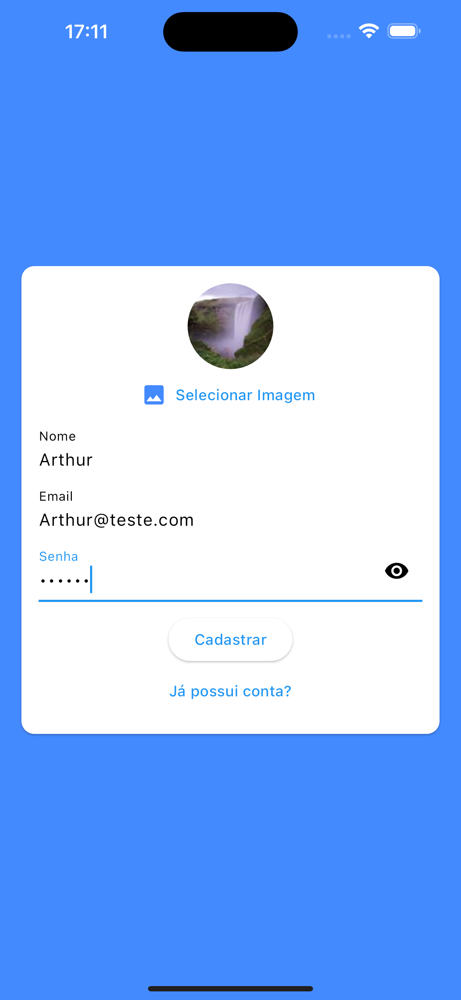
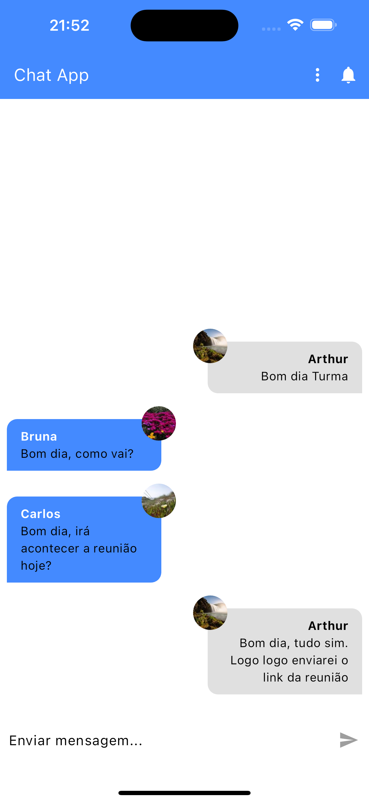
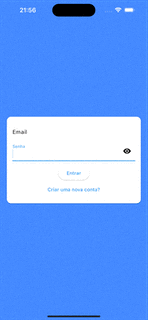

# Chat_App
Este é um aplicativo de Chat, com principal intuito de aprender PushNotifaction, Firebase e Upload de Imagens em flutter

### O que eu aprendi neste aplicativo
Neste aplicativo, aprendi conceitos de PushNotification, Firebase e Upload de Imagens em Flutter
 

### Layout

 

#### GIFS

## Como foi feito este projeto?

Este projeto foi totalmente feito a partir de um curso da udemy, na qual você pode [clicar aqui](https://www.udemy.com/course/curso-flutter/?couponCode=ST6MT42324) para acessar o curso 

Neste projeto contém estruturas de fundamentos de flutter, sendo elas:
- [X] Auth Page;
- [X] Upload de Imagens;
- [X] Stream;
- [X] Chat;
- [X] Message Bubble;
- [X] Autenticação com Firebase;
- [X] Armazenamento de mensagens no Firestore;
- [X] PushNotification;

### Dependências
- ``image_picker: ^1.1.2``
- ``provider: ^6.1.2``
- ``cloud_firestore: ^5.1.0``
- ``firebase_auth: ^5.1.2``
- ``firebase_storage: ^12.1.1``
- ``firebase_messaging: ^15.0.3``

### Tecnologias utilizadas
- ``VSCode``
- ``Dart``
- ``Flutter``
- ``XCode = Emulador de IOs``
- ``Android Studio = Emulador Android``
- ``iPad = Emulador iPadOS``

#### Observação
Não consegui testar o PushNotification no iOS pois não tenho conta no apple developer.

